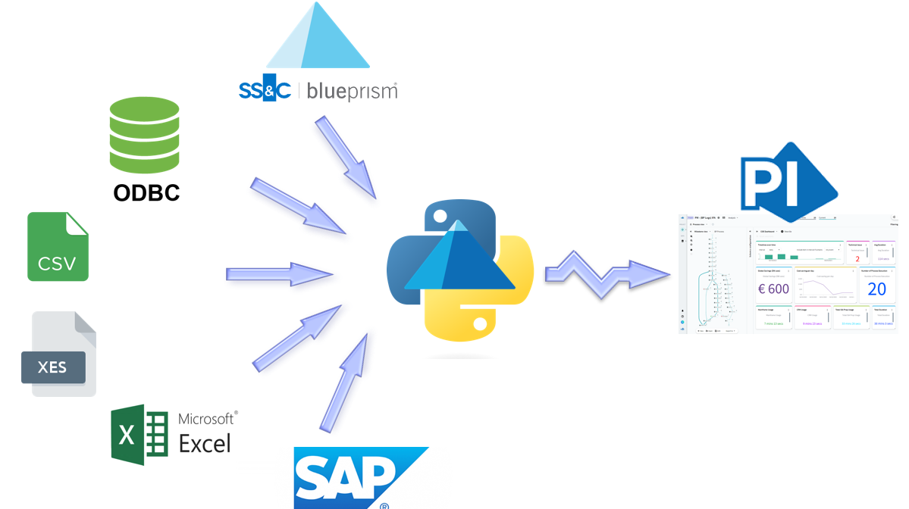

# Presentation

This repository proposes a Python program that makes a bridge between Blue Prism Process Intelligence (alias BPPI) and external data sources. Its purpose is to access these external datasources, collect them ant automate their importation into a BPPI instance (cloud or on-prem). By executing a TO DO into the BPPI repository it also enables to performs BPPI transformations and load directly in one or several projects.  
Currently this bridge can access and load data from
* [External file (csv)](https://github.com/datacorner/pyBPPIBridge/wiki/CSV-File)
* External Excel Spreadsheet (xls, xlsx, xlsm, xlsb, odf, ods and odt)
* External XES File
* ODBC Data Sources (checked with SQL Server) by using an configurable SQL query
* Blue Prism repository (Can gather all the session logs for a specified process)   
* SAP Read Table via SAP RFC

This bridge reads the data from the Datasource and upload them into the BPPI Repository. Inside BPPI it's also possible to configure a TODO to automate some transformations and load the data into a BPPI Project (The program can execute thess To Do automatically). To make this bridge usable the user must configure a Data Source in the BPPI Repository, and get a token.  

Note: BPPI is the solution provided by Blue Prism for Process and Task Mining (ABBYY Timeline OEM).

[Look at the wiki for more informations](https://github.com/datacorner/pyBPPIBridge/wiki)
